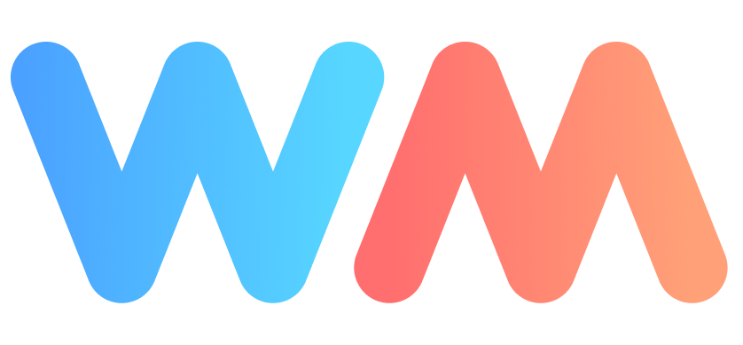

# "wgpu-mc" —— 用 Rust 构建的 Minecraft 渲染引擎

[English](README.md) | **简体中文**

> [!WARNING]
> 原项目 wgpu-mc 仍处于 **Beta** 阶段。[欢迎贡献](https://github.com/wgpu-mc/wgpu-mc/labels/engine)。 

**wgpu-mc** 是一个独立的 [WebGPU](https://www.w3.org/TR/webgpu/) 渲染引擎，使用 Rust 编写，基于 [`wgpu`](https://gpuweb.github.io/gpuweb/) crate。项目始于 2021 年末，最初只是一个玩具项目：为 Minecraft 打造一个新的渲染引擎，以取代现有的 OpenGL 渲染器。
## 关于这个 "wgpu-mc-neo" 项目
#### 这是 wgpu-mc 的非官方 **neoforge** 分支。
> [!WARNING]
> 由于原项目距离既定目标相去甚远，本项目对其 Rust 侧进行了重构与改造。**因此它不再是一个单纯跟随上游迁移的子项目**。出于可维护性与作者精力的考虑，本项目已移除 Fabric 模组部分。

作者最初的想法，是在这样一个实验性项目中引入光追/路径追踪，以及 DirectX 下的 DLSS、DLSSD、DLSSR 等现代图形技术。但受 WebGPU 这一 crate 的能力所限，目前只能通过 hook C++ 库之类相当“脏”的手段来实现。因此，本项目不再考虑加入这些技术，转而专注于提升这个跨 API 图形项目的实用性与稳定性。

## Neolectrum —— 面向 Minecraft 的 Rust 渲染引擎模组
> [!CAUTION]
> Electrum 目前仍在开发中。[欢迎参与贡献！](https://github.com/wgpu-mc/wgpu-mc/labels/electrum)。

#### **Neolectrum** 是一个 Neoforge 模组，它集成了 wgpu-mc 渲染引擎，用以取代现有的 Blaze3D 渲染引擎。

我们通过 mixin 在游戏启动时劫持原有的 GL 渲染器，并借助 Rust 完整的 GLSL 到 WGSL 转译流程以及基于 WebGPU 的渲染管线，把 Minecraft 的渲染后端替换为 DirectX12、Vulkan、Metal，乃至更多后端。（目前可用的是 Vulkan 与 DirectX12。）